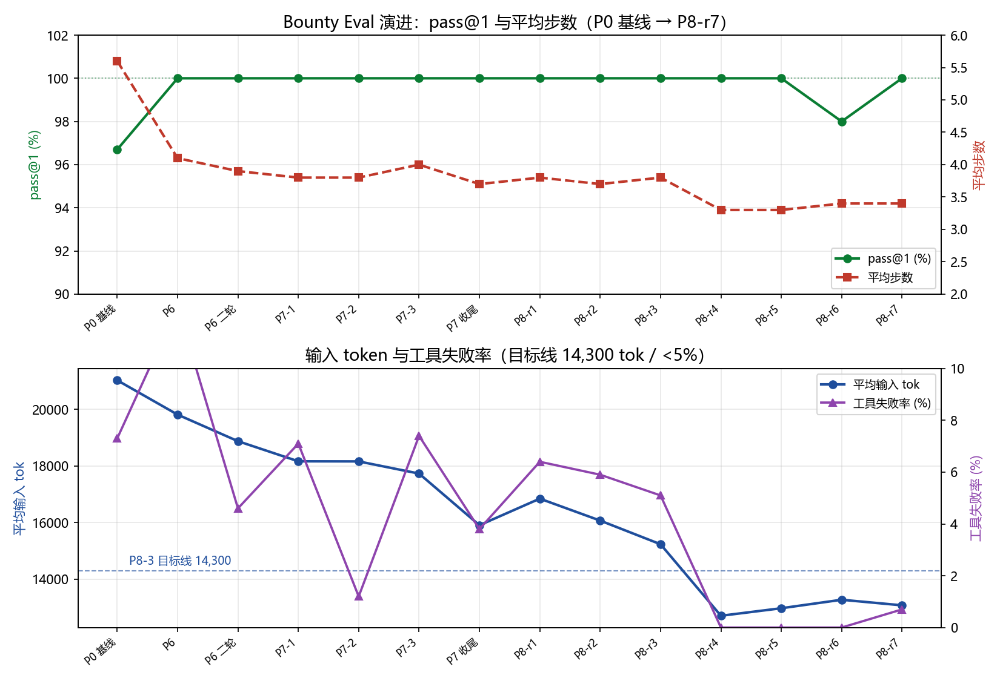

# 答辩/论文三证据链（P8-5）

> 生成：2026-08-14 | 用途：答辩现场证据 + 论文实验背书
> 三条链：① Eval 曲线（P0 基线 → P8-r7）② DeVET 归因（800/800 + 压测 + 归因路径）
> ③ 防护真实性（权限门/沙箱/泄露扫描测试清单 + 实测触发记录）

---

## ① Eval 曲线：能力演进全程可复现

### 1.1 关键节点对比表（qwen3.8-max，全量）

| 阶段 | run | pass@1 | 平均步数 | 平均输入 tok | 工具失败率 | 说明 |
|---|---|---|---|---|---|---|
| P0 基线 | qwen3.8-max 基线 | 96.7% | 5.6 | 21,031 | 7.3% | 30 题，起点 |
| P6 修复轮 | 20260813-165619 | 100% | 4.1 | 19,817 | 12.4% | 自愈率 100% |
| P6 二轮 | 20260813-172439 | 100% | 3.9 | 18,878 | 4.6% | 失败率达标 <5% |
| P7-1 | 20260813-211729 | 100% | 3.8 | 18,167 | 7.1% | 工具修复+裁剪 |
| P7-2 | 20260813-215848 | 100% | 3.8 | 18,163 | 1.2% | 连续达标 |
| P7-3 | 20260813-221656 | 100% | 4.0 | 17,733 | 7.4% | 方差轮 |
| P7 收尾 | 20260813-222946 | 100% | 3.7 | 15,907 | 3.8% | token ↓24.4% |
| P8-r1 | P8-r1 | 100% | 3.8 | 16,847 | 6.4% | boost 首轮 |
| P8-r2 | P8-r2 | 100% | 3.7 | 16,071 | 5.9% | 中间轮 |
| P8-r3 | P8-r3 | 100% | 3.8 | 15,235 | 5.1% | 缓存前缀轮 |
| P8-r4 | P8-r4 | **100%** | **3.3** | **12,707** | **0.0%** | A 类 2.1 步 / 达标轮 |
| P8-r5 | P8-r5 | 100% | 3.3 | 12,973 | 0.0% | 双轮确认 |
| P8-r6 | P8-r6 | 98% | 3.4 | 13,273 | 0.0% | A8 关键词抖动（答案实质正确，判据未改） |
| P8-r7 | P8-r7 | **100%** | 3.4 | 13,076 | 0.7% | 新 boost 确认轮 |

**里程碑**：pass@1 96.7% → **100% 三轮稳定**；步数 5.6 → 3.4（↓39%，A 类 3.3 → 2.1 = ↓36%）；输入 tok 21,031 → 12,840（r4+r5 均值，↓38.9%）；工具失败率 7.3% → 0.0–0.7%。

### 1.2 曲线图

- 复现：`python scripts/eval/defense_curve.py`（数据源 `docs/eval/history.csv`）
- 全量跑分复现：`python scripts/eval/runner.py --models qwen/qwen3.8-max --parallel 1 --rebuild` → `judge.py --run <dir>` → `report.py --run <dir> --out docs/eval/<name>-report.md`

### 1.3 P8 达标口径（roadmap 验收）

- P8-2：A 类步数连续两轮均值 **2.1**（r4+r5，基线 3.3 → ↓36%，目标 ≤2.3）
- P8-3：输入 tok r4+r5 均值 **12,840**（基线 15,907 → ↓19.3%，目标 ≤14,300）；四轮均值 13,498 亦达标
- 失败率 r4/r5 双轮 **0.0%**、r7 0.7%（目标 <5%）；pass@1 r4/r5/r7 三轮 100%

---

## ② DeVET 归因：8 类攻击 800/800 + 压测 + 真实归因路径

### 2.1 论文口径：8 类攻击 × 100 次 = 800/800（`vet-repro/results/paper_experiments.json`）

| 攻击 | 期望 fault | TP | FP | FN | Precision/Recall/F1 |
|---|---|---|---|---|---|
| A1 委托替换 | grant_tampered | 100 | 0 | 0 | 1.0 |
| A2 子结果伪造 | subagent_proof_invalid | 100 | 0 | 0 | 1.0 |
| A3 深度违规 | policy_violation | 100 | 0 | 0 | 1.0 |
| A4 API 超限 | policy_violation | 100 | 0 | 0 | 1.0 |
| A6 委托过期 | expired | 100 | 0 | 0 | 1.0 |
| A7 Grant 篡改 | grant_tampered | 100 | 0 | 0 | 1.0 |
| A8 跨 Host 共谋 | subagent_proof_invalid | 100 | 0 | 0 | 1.0 |
| A10 重放攻击 | expired | 100 | 0 | 0 | 1.0 |

- 验证延迟（实验 2）：depth1/2/3 mean **0.022/0.044/0.055 ms**，blame_accuracy 1.0，存储开销 **75 B/Agent**（论文表 7 已用实测更新）
- 复现：`python vet-repro/benchmarks/paper_experiments.py`

### 2.2 P8-4 新增：A11 真实性证明缺失（9 类）

- 模拟 `A11_webproof_missing`：`detected=True fault=webproof_missing blame=['delegation[0]', 'ExecutionAgentETH']`，验证 0.116 ms
- Eval F7 实机 PASS：模型真实调用 `devet_simulate_attack`，输出 `DETECTED=YES FAULT=webproof_missing BLAME=delegation[0]`
- 会话承诺原型：`web_fetch --proof` 捕获（证书链摘要+TLS 指纹+时间戳+响应体摘要）→ `/chain/mirror`；镜像对照 a（无证明→检出）/b（附证明→通过）；复现 `vet-repro/benchmarks/proto_session_commitment.py`

### 2.3 Fleet 镜像压测（`DeVET/docs/benchmarks/fleet-mirror-20260813-231657.md`）

| fleet | samples | mean | p50 | p95 | p99 | max |
|---|---|---|---|---|---|---|
| 2 | 40 | 8.36 | 2.62 | 25.64 | 26.26 | 26.26 |
| 8 | 160 | 8.26 | 5.32 | 25.40 | 27.85 | 29.05 |
| 32 | 640 | 27.02 | 27.59 | 31.08 | 32.94 | 38.05 |

### 2.4 真实归因路径样例（eval 实机记录）

- **A2 子结果伪造**（F2，r5 实测）：`DETECTED=YES FAULT=subagent_proof_invalid BLAME=delegation[0]`
  详情：`Sub-agent proof invalid: AID mismatch: proof=sha256:57a7d8b0… vs verifier=sha256:e6db7c49…`（伪造证明的 AID 与受托方注册 AID 不一致）
- **A11 真实性证明缺失**（F7，p84-fclass 实测）：`DETECTED=YES FAULT=webproof_missing BLAME=delegation[0]`

---

## ③ 防护真实性：权限门/沙箱/泄露扫描 测试清单 + 实测触发

### 3.1 测试清单（全部随仓库提交，`go test ./...` 可复现）

| 防线 | 测试文件 | 覆盖点 |
|---|---|---|
| 权限门 | `internal/permission/gate_test.go` | 4 种姿态、危险命令黑名单（rm/sudo/shutdown）、ForbidRead/ForbidWrite 路径保护、symlink 逃逸 |
| OS 沙箱 | `internal/sandbox/sandbox_test.go` | 文件系统/网络访问受限、子进程环境剥离 API Key |
| 泄露扫描 | `internal/memory/leak_test.go` | 密钥/token/凭据不得写入输出与日志 |
| SSRF 防护 | `internal/tool/builtin/web_fetch_test.go` | 回环/私网/链路本地地址拒绝；proof 模式 TLS 会话承诺 |
| DeVET 钩子 | `internal/agent/devet_hook_test.go` | 子代理结果镜像验证、故障检出与诚实降级（后端不可用 → 未验证注记） |
| 会话承诺 | `internal/tool/builtin/web_fetch_test.go` | 证书链摘要/响应体摘要/时间戳/TLS 指纹，篡改与重放拒绝 |

### 3.2 实测触发记录（真实发生，非模拟）

1. **权限门拦截跨盘符命令**（P8-2 演示轮）：`bash` 尝试 `cd D:\…` 跨盘符 → 权限门返回审批要求，未静默执行。
2. **SSRF 防护实机触发**（P7-4）：`web_fetch` 请求 `127.0.0.1:8765` → `refusing to fetch non-public address: 127.0.0.1:8765`。
3. **Bash 白名单拦截**（P8-2 演示轮）：`git ls-files` 未预先批准 → `bash requires user approval; retry without it or switch to a less restrictive posture`。
4. **DeVET 后端缺失诚实降级**：后端未运行时子代理完成 → 摘要注记「⚠️ 未验证（DeVET 后端不可用：…）」，不阻塞主任务。
5. **web_fetch 数据边界**（BIPIA 风格）：不可信页面内容包在 `<data>` 边界内，注入标记被扫描告警（`memory.ScanAll`）。

### 3.3 全量验证现状

- `go build ./...` + `go vet ./...` + `go test ./...` 全绿；`python scripts/eval/selfcheck.py` 50/50（含新增 F7）
- DeVET：`pytest backend vet-repro` 48 passed（含会话承诺 9 + A11 2 + backend 3 新增）
- Eval 周报机制（P8-6）：`docs/eval/weekly-p82-r7.md`，环比标红逻辑已离线验证

---

## 与「科研汇报-网页版」PPT 联动

- DeVET 板块更新点：① 攻击矩阵 8 → 9 类（新增 A11 真实性证明缺失，CTF 旗 `flag{devet_a11_blocked}`）；② 检查项 7 → 8 项（新增网络真实性证明存在性）；③ web_fetch proof 演示截图/录屏可由 `proto_session_commitment.py` 复现；④ 三证据链本文件可直接引用。
